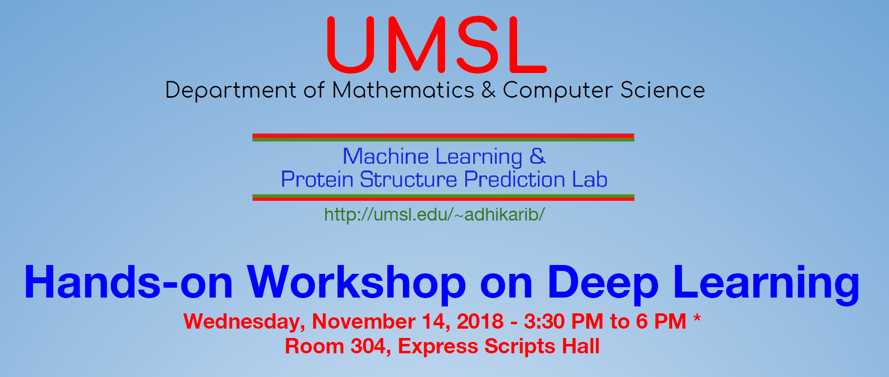

https://calendar.umsl.edu/event/hands-on_deep_learning_workshop

## Hands-on Workshop on Deep Learning  
#### Department of Mathematics & Computer Science, University of Missouri-St. Louis  
Wednesday, November 14, 2018 - 3:30 PM to 6 PM \*  
Room 304, Express Scripts Hall  

\* The actual workshop is from 4:00 PM to 6:00 PM but you need to arrive by 3:15 PM to verify that you can access Microsoft Azure or Google Colab to run Python Notebooks.

### What will I learn?
- Running codes in Jupyter Notebooks - the platform to develop deep learning applications
- Predict whether a person has diabetes or not using the medical attributes provided (binary classification using neural networks on the Pima Indian Diabetes dataset) and adapt the example to predict crime in St. Louis
- Classify digit images using convolutional neural networks on the MNIST dataset (multi-class classification) and adapt the example to classify a small image dataset we curated
	
### What do I need to bring with me? 
- A laptop to install Anaconda with Jupyter Notebook (we will not provide computers)

### Who can apply?
- You need to be able to code computer programs (it does not matter what language)

### Who will be registered?
- We have 25 seats. We will review all submitted applications and notify you if you are selected by Nov 12.
	
### Will I receive a certificate?
- Yes, certificates will be awarded at conclusion of workshop to those who attend the workshop
	
### How can I apply?
- Apply online at http://bit.ly/deeplearningworkshop 

### Who is organizing this workshop?
- We are a group of five students currently doing various deep learning projects at Prof. Adhikari’s “Machine Learning and Protein Structure Prediction Lab”
	
### I have some questions, who should I contact?
- Anthony - akmqq@mail.umsl.edu
- Cody - ch3rc@mail.umsl.edu
- Patrick - pkhc5@mail.umsl.edu
- Brandon - bmknn3@mail.umsl.edu
- Som - spfh9@mail.umsl.edu

